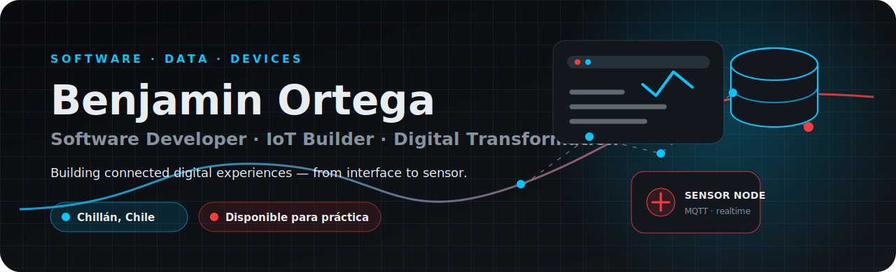
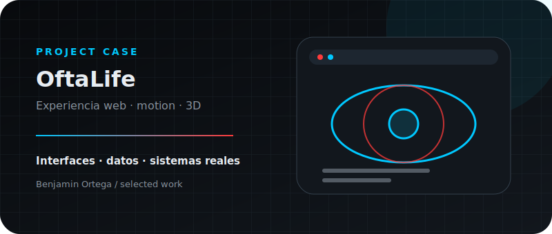
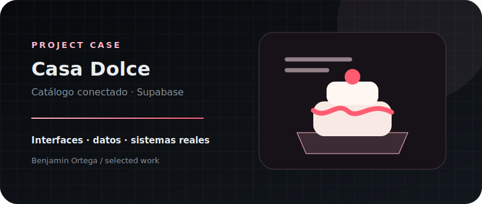
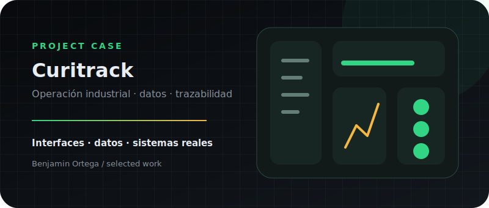
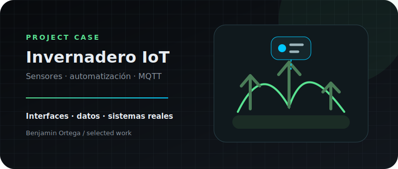

<picture>
  <source media="(prefers-color-scheme: dark)" srcset="./assets/hero-dark.svg">
  <source media="(prefers-color-scheme: light)" srcset="./assets/hero-light.svg">
  
</picture>

### Conecto interfaces, datos y dispositivos para convertir problemas reales en sistemas útiles.

**Estudiante de 4.º año de Ingeniería en Informática · Santo Tomás Chillán**  
Construyo experiencias web, sistemas de gestión y prototipos IoT, desde la interfaz hasta el sensor.

`Chillán, Chile` · `Disponible para práctica profesional` · `Abierto a oportunidades junior`

## Lo que construyo

<table>
<tr>
<td width="33%" valign="top">

### Experiencias web

Diseño interfaces modernas, responsivas y con identidad propia. Integro animaciones, catálogos, bases de datos y recorridos pensados para usuarios reales.

`React` `Next.js` `TypeScript` `Tailwind` `Motion` `GSAP` `Three.js`

</td>
<td width="33%" valign="top">

### Sistemas conectados

Desarrollo prototipos que capturan información desde sensores, transmiten datos y los convierten en paneles, alertas y acciones automáticas.

`Arduino` `ESP32/8266` `MQTT` `Node-RED` `Sensores` `Tiempo real`

</td>
<td width="33%" valign="top">

### Procesos digitales

Transformo flujos manuales en aplicaciones que centralizan información, controlan estados, gestionan permisos y generan documentos útiles.

`Supabase` `PostgreSQL` `Firebase` `RLS` `PDF` `Excel` `Dashboards`

</td>
</tr>
</table>

## Del problema al sistema

### `Observar → Entender → Diseñar → Construir → Conectar → Medir → Mejorar`

Mi trabajo comienza entendiendo el proceso real. A partir de ahí diseño la experiencia, modelo los datos y conecto las piezas necesarias: desde una interfaz web hasta una base de datos, un flujo automatizado o un sensor físico.

## Proyectos destacados

### OftaLife · Experiencia digital para una óptica

Experiencia web experimental para una óptica, enfocada en una presentación elegante, interacción fluida y composición visual avanzada. Combina diseño responsivo, movimiento controlado y elementos tridimensionales.

**Aportes principales:** experiencia visual, adaptación móvil, microinteracciones y componentes 3D.  
**Stack:** React · TypeScript · Vite · Tailwind CSS · Motion · Three.js · OGL · Radix UI · Material UI

[Ver demo](https://ofta-life.vercel.app) · [Explorar código](https://github.com/BenjaOrtega1/Ofta-Life)

---

### Casa Dolce · Catálogo conectado para una pastelería boutique

SPA de catálogo para una pastelería artesanal premium. Presenta productos, galería, testimonios y contenido visual, con datos conectados a Supabase y un flujo que prepara solicitudes mediante WhatsApp.

**Aportes principales:** identidad boutique, catálogo dinámico, navegación orientada a conversión e integración de datos.  
**Stack:** React · TypeScript · Vite · Tailwind CSS · Supabase · PostgreSQL · Motion

[Ver demo](https://casa-dolce.vercel.app) · [Explorar código](https://github.com/BenjaOrtega1/CasaDolce)

---

### Curitrack · Digitalización de la recepción de cereales

Prototipo académico desarrollado a partir del proceso observado en Curimapu Chillán. Centraliza el flujo desde el ingreso del camión hasta la planilla general: romana, laboratorio, almacenamiento, documentos y exportaciones.

**Aportes principales:** modelamiento de estados, autenticación, roles, permisos, RLS, auditoría, modo demo aislado, generación de PDF y exportación a Excel.  
**Stack:** React · Vite · Tailwind CSS · Supabase · React Three Fiber · Three.js · GSAP · Motion · jsPDF · XLSX

[Ver demo](https://prototipo-curimapu.vercel.app) · [Explorar código](https://github.com/BenjaOrtega1/prototipo_curimapu)

---

### Invernadero inteligente · Monitoreo y riego automático

Sistema IoT que mide humedad del suelo y condiciones ambientales, activa automáticamente una bomba de riego y publica los datos mediante MQTT para visualizarlos en Node-RED.

**Aportes principales:** integración de hardware, comunicación serial, automatización por umbrales, telemetría MQTT y dashboard en tiempo real.  
**Stack:** Arduino Nano · ESP8266 · DHT11/DHT22 · sensores de suelo · relé · MQTT · Node-RED

[Explorar código](https://github.com/BenjaOrtega1/Invernadero)

---

### Estación de Calidad de Chillán · Datos ambientales en tiempo real

Dashboard web desarrollado con React para recibir información por MQTT y convertirla en visualizaciones mediante Chart.js.

**Stack:** React · MQTT · Chart.js · React Chart.js · Tailwind CSS

[Ver demo](https://estacion-calidad-chillan.vercel.app) · [Explorar código](https://github.com/BenjaOrtega1/EstacionCalidadChill-n)

## Más allá de la pantalla

<table>
<tr>
<td width="33%" valign="top">

### SmartBee

Monitoreo IoT de colmenas mediante sensores de temperatura, humedad, peso, partículas y radiación UV, con MQTT y dashboard React.

</td>
<td width="33%" valign="top">

### Industria 4.0

Control de camiones con ESP32, sensor de distancia, señalización RGB, MQTT, Firestore y registro de eventos en tiempo real.

</td>
<td width="33%" valign="top">

### Android + MQTT

Aplicación Java para TecnoPrint3D con gestión de clientes en SQLite, operaciones CRUD, galería y comunicación MQTT.

</td>
</tr>
</table>

## TecnoPrint3D · tecnología aplicada a un negocio real

[TecnoPrint3D](https://tecnoprint3d.cl) es mi emprendimiento de diseño, impresión 3D y fabricación personalizada. También funciona como un laboratorio real para aplicar desarrollo de software, diseño de producto y optimización de procesos.

He trabajado en un ecosistema con catálogo público, panel administrativo, productos, galerías, cotizaciones, pedidos, clientes, inventario, gastos, estados de pago, fechas de entrega, alertas, autenticación y permisos mediante Supabase.

> Construir para un negocio propio me obliga a considerar algo más que el código: usuarios, costos, materiales, producción, rendimiento, mantenimiento y experiencia de cliente.

## Tecnologías con las que trabajo

**También he trabajado con:** JavaScript, HTML, CSS, Vite, Motion, GSAP, React Three Fiber, Material UI, Radix UI, SQLite, REST APIs, Node-RED, ESP32, ESP8266, Java, Android Studio, Unity, Packet Tracer y Orange Data Mining.

## GitHub en números

  <picture>
    <source media="(prefers-color-scheme: dark)" srcset="https://github-readme-stats.vercel.app/api?username=BenjaOrtega1&show_icons=true&hide_border=true&bg_color=00000000&title_color=00C8FF&text_color=E8EDF2&icon_color=FF3B3B&locale=es">
    <source media="(prefers-color-scheme: light)" srcset="https://github-readme-stats.vercel.app/api?username=BenjaOrtega1&show_icons=true&hide_border=true&bg_color=00000000&title_color=007F9E&text_color=12171D&icon_color=E33333&locale=es">
    
  </picture>
  <picture>
    <source media="(prefers-color-scheme: dark)" srcset="https://github-readme-stats.vercel.app/api/top-langs/?username=BenjaOrtega1&layout=compact&hide_border=true&bg_color=00000000&title_color=00C8FF&text_color=E8EDF2&langs_count=6">
    <source media="(prefers-color-scheme: light)" srcset="https://github-readme-stats.vercel.app/api/top-langs/?username=BenjaOrtega1&layout=compact&hide_border=true&bg_color=00000000&title_color=007F9E&text_color=12171D&langs_count=6">
    
  </picture>

Estas tarjetas resumen repositorios públicos y no representan porcentajes de dominio profesional.

## Actividad

<picture>
  <source media="(prefers-color-scheme: dark)" srcset="https://raw.githubusercontent.com/BenjaOrtega1/BenjaOrtega1/output/github-snake-dark.svg">
  <source media="(prefers-color-scheme: light)" srcset="https://raw.githubusercontent.com/BenjaOrtega1/BenjaOrtega1/output/github-snake.svg">
  
</picture>

## Hablemos

Actualmente estoy finalizando Ingeniería en Informática y busco una práctica profesional donde pueda aportar en desarrollo web, automatización, integración de datos o IoT.

**Building connected digital experiences — from interface to sensor.**

